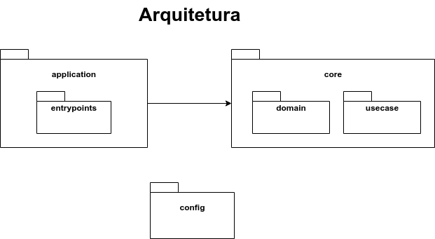

##  Aplicação para Cálculo do IMC


Aplicação que realiza o cálculo do IMC (Indice de Massa Corpóral).


Para mais detalhes da Aplicação acesse o [Tutorial](https://blog.cvinicius.com.br/2021/03/construindo-uma-aplicacao-completa-com.html) que fala sobre todo o processo de desenolvimento.

### 📝 Arquitetura do Projeto



### 💻 Tecnologias
- [x] Kotlin
- [x] Maven
- [x] Docker
- [x] Spring Boot

## 🚀 Executando

### ☕ Maven

Após o clone execute o seguinte comando:
```
mvn spring-boot:run
ou 
./mvnw spring-boot:run
```

O Acesso deve ser realizado em http://localhost:8080

### ☕ Docker

#### Build Maven

```
mvn build
ou 
./mvnw build
```

#### Criação da Imagem 

```
docker image build -t app-imc:1.0.0 .
```

#### Execução

```
docker container run --name app-imc -d -p 80:80 app-imc:1.0.0 
```

[⬆ Voltar ao topo](#napp-imc)<br>
